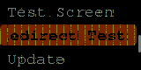

# OpenMenuOS Library Documentation

## **What's New in v3.1.0 (2025/06/15)?**
### **Revolutionary PopupManager System**
- **Professional PopupManager** with 5 distinct popup types: Info, Success, Warning, Error, and Question
- **Advanced popup features**: Auto-close functionality, custom colors, icons, and word wrapping
- **Non-blocking operation** with proper button debouncing and input validation
- **Encoder support** for popup navigation: rotate to select buttons, press to confirm
- **Visual feedback** with button selection indicators and semi-transparent overlays
- **Input blocking** ensures clicks don't reach underlying screens when popups are active

### **Enhanced User Experience**
- **Professional visual design** with shadows, rounded corners, and color-coded popup types
- **Improved button handling** with proper press/release detection preventing false triggers
- **Optimized display performance** with frame comparison and efficient canvas management
- **Better input isolation** between popups and menu systems

### **Code Quality Improvements**
- **Bug fixes**: Canvas sprite creation, encoder validation, null pointer checks
- **Performance optimizations**: ScrollTextHorizontal functions, calculateMaxCharacters algorithm
- **Memory efficiency**: Enhanced drawCanvasOnTFT with intelligent frame comparison
- **Robust error handling** for edge cases and invalid inputs

## **What's New in v3.0.0?**
Here are the significant updates and improvements:

### **Code Refactoring and Fixes**
- Variables moved to the private section of the class for better encapsulation and maintainability.
- Fixed issues with scrollbar height for submenus.
- Fixed scrolling text issues with non-black background colors.

### **Enhanced Menu System**
- Menus (main, submenus, and settings) now dynamically adapt to the display size.
- Unlimited screens and menu levels—replacing the previous limitation of 3 levels.
- Fixed main menu item scrolling issues when returning from submenus.

### **Settings Overhaul**
- Replaced the old boolean-only settings system with object-based settings.
  - Supports a variety of data types: options, ranges, and booleans.
  - Includes default value support (overridden when values are changed in EEPROM).
  - Full functionality for all setting types with proper EEPROM storage (v3.1.0).

### **New Features**
- Added a function to retrieve the library version.
- Added smoother text scrolling.
- Added the ability to set a boot image.
- Added font customization options for menus.

### **Storage Handling**
- Improved storage handling by using `preferences.h` on ESP32 and `EEPROM` on ESP8266.

### **Additional Fixes**
- Resolved an issue where long-pressing the select button did not correctly return to the last screen.
- Removed the `tft_bl` argument from the menu instance (can now be set in `TFT_eSPI`'s config).

  
This demo was recorded using the **"Screenshot"** feature provided by TFT_eSPI.  
The visible lines on the recording are not present on the actual display; they are likely caused by noise during data transmission from the display to the computer.  

Additionally, while the demo may appear laggy, this is due to the low recording frame rate. The display could not refresh while the screenshot data was being transmitted.

## Table of Contents
- [Introduction](#introduction)
- [Features](#features)
- [Hardware Requirements](#hardware-requirements)
- [Installation](#installation)
- [Quick Start](#quick-start)
- [PopupManager System](#popupmanager-system)
- [Advanced Usage](#advanced-usage)
- [API Reference](#api-reference)
- [Examples](#examples)
- [Troubleshooting](#troubleshooting)
- [Performance Tips](#performance-tips)
- [Contributing](#contributing)
- [License](#license)

## 📚 Documentation
- **📖 [Complete Documentation](docs/README.md)** - Arduino IDE compatible overview
- **🔧 [Full API Reference](docs/api.md)** - Detailed method documentation  
- **💡 [Code Examples](docs/examples.md)** - Practical implementation guides

## Introduction
OpenMenuOS is a comprehensive Arduino library designed to create professional, responsive menu systems on TFT displays using the TFT_eSPI library. Compatible with ESP32 and ESP8266 boards, it provides an intuitive API for building complex user interfaces with minimal code.

## Features

### **Core Menu System**
- 🎛️ **Multi-level menus** with unlimited depth
- 📱 **Responsive design** that adapts to any display size
- 🎨 **Customizable themes** and style presets
- 📊 **Dynamic scrollbars** with smooth animations
- 🖼️ **Icon support** for enhanced visual appeal
- ⚡ **Optimized rendering** with frame comparison

### **Professional PopupManager**
- 💬 **5 popup types**: Info, Success, Warning, Error, Question
- 🎭 **Visual customization**: Colors, icons, shadows, rounded corners
- 🔄 **Auto-close functionality** for temporary notifications
- 📝 **Automatic word wrapping** for long messages
- 🎮 **Multiple input methods**: Buttons and rotary encoder support
- 🚫 **Input blocking** prevents accidental interactions

### **Advanced Settings System**
- ⚙️ **Multiple data types**: Boolean, Range, Option, Subscreen
- 💾 **EEPROM/Preferences storage** with automatic persistence
- 🔧 **Dynamic configuration** with real-time updates
- 🎚️ **Animated toggle switches** and range sliders
- 📋 **Option lists** with custom values

### **Input Handling**
- 🔘 **Button support** with debouncing and long-press detection
- 🔄 **Rotary encoder** support with interrupt-driven processing
- 📱 **Touch support** (when available on display)
- ⌨️ **Configurable pin assignments** and voltage levels
- 🔒 **Input validation** and error prevention

### **Performance & Efficiency**
- 🚀 **Optimized rendering** with sprite caching
- 💾 **Memory efficient** with intelligent resource management
- 🔄 **Smooth animations** with easing functions
- 📊 **Frame rate optimization** and display update control
- ⚡ **Fast response times** with optimized algorithms

## Hardware Requirements

### **Supported Microcontrollers**
- **ESP32** (all variants)
- **ESP8266** (NodeMCU, Wemos D1, etc.)
- **Arduino-compatible boards** with sufficient memory

### **Display Requirements**
- **TFT displays** supported by TFT_eSPI library
- **Recommended**: 160x128 or higher for optimal experience
- **Color depth**: 16-bit color (RGB565)

### **Input Hardware**
- **Buttons**: Up, Down, Select (configurable pins)
- **Rotary encoder**: CLK, DT, SW pins (optional)
- **Voltage levels**: 3.3V or 5V compatible

### **Memory Requirements**
- **Flash**: ~50KB for library code
- **RAM**: 2-8KB depending on display size and features
- **EEPROM/Preferences**: 1-2KB for settings storage

## Installation

### **Method 1: Arduino Library Manager**
1. Open Arduino IDE
2. Go to `Tools` → `Manage Libraries...`
3. Search for "OpenMenuOS"
4. Click `Install`

### **Method 2: ZIP Library**
1. Download the ZIP file from GitHub
2. In Arduino IDE: `Sketch` → `Include Library` → `Add .ZIP Library...`
3. Select the downloaded ZIP file

### **Dependencies**
The following libraries are required and will be installed automatically:
- **TFT_eSPI** (for display control)
- **Arduino Core** libraries

### **Arduino IDE Compatibility**
✅ **Arduino IDE 1.8.x**: Fully supported  
✅ **Arduino IDE 2.x**: Fully supported  
✅ **Documentation**: Available in `Tools` → `Manage Libraries` → `OpenMenuOS` → `More info`  
✅ **Examples**: Accessible via `File` → `Examples` → `OpenMenuOS`  
✅ **Auto-complete**: Full IntelliSense support for all methods  

**📁 Library Structure for Arduino IDE:**
```
OpenMenuOS/
├── src/                    # Core library files
│   ├── OpenMenuOS.h       # Main header file
│   └── OpenMenuOS.cpp     # Implementation
├── examples/              # Example sketches
│   └── OpenMenuOS_Simple/ # Basic usage example
├── docs/                  # Documentation
│   ├── README.md         # Arduino IDE overview
│   ├── api.md            # Complete API reference
│   └── examples.md       # Code examples
├── library.properties    # Arduino library metadata
└── README.md             # This comprehensive guide
```

## Quick Start

### **Basic Setup**

```cpp
#include "OpenMenuOS.h"

// Pin configuration
#define BTN_UP     19    // Up button pin
#define BTN_DOWN   -1    // Down button pin (disabled)
#define BTN_SELECT 2     // Select button pin

// Create menu system instance
OpenMenuOS menu(BTN_UP, BTN_DOWN, BTN_SELECT);

// Create screens
MenuScreen mainMenu("Main Menu");
SettingsScreen settingsScreen("Settings");

void setup() {
  Serial.begin(115200);
  
  // Configure settings
  settingsScreen.addBooleanSetting("WiFi", true);
  settingsScreen.addRangeSetting("Brightness", 0, 100, 75, "%");
  
  // Configure main menu
  mainMenu.addItem("Settings", &settingsScreen);
  mainMenu.addItem("About", nullptr, showAbout);
  
  // Apply style and start
  menu.useStylePreset("Rabbit_R1");
  menu.begin(&mainMenu);
}

void loop() {
  menu.loop();
}

void showAbout() {
  PopupManager::showInfo("OpenMenuOS v3.1.0\nProfessional Menu System", "About");
}
```

### **Encoder Setup**
```cpp
// Enable rotary encoder support
menu.setEncoderPin(5, 2);  // CLK, DT pins
menu.setSelectPin(19);     // Encoder button pin
```

## PopupManager System

### **Popup Types**
OpenMenuOS includes a professional popup system with 5 built-in types:

#### **1. Info Popup**
```cpp
PopupManager::showInfo("Operation completed successfully!", "Information");
```

#### **2. Success Popup**
```cpp
PopupManager::showSuccess("Settings saved!", "Success");
// Auto-closes after 3 seconds
```

#### **3. Warning Popup**
```cpp
PopupManager::showWarning("Low battery detected", "Warning");
```

#### **4. Error Popup**
```cpp
PopupManager::showError("Connection failed", "Error");
```

#### **5. Question Popup**
```cpp
PopupResult result = PopupManager::showQuestion("Save changes?", "Confirm");
// Returns PopupResult::OK or PopupResult::CANCEL
```

### **Advanced Popup Configuration**
```cpp
PopupConfig config;
config.message = "Custom popup message";
config.title = "Custom Title";
config.type = PopupType::INFO;
config.autoClose = true;
config.autoCloseDelay = 5000;  // 5 seconds
config.showButtons = true;
config.showCancelButton = true;
config.customIcon = myIcon;
config.customIconWidth = 32;
config.customIconHeight = 32;

PopupResult result = PopupManager::show(config);
```

### **Popup Input Handling**
```cpp
void loop() {
  // Handle popup interactions first
  PopupResult popupResult = PopupManager::update();
  
  // Only process menu if no popup is active
  if (!PopupManager::isActive()) {
    menu.loop();
  }
  
  // Handle popup results
  if (popupResult != PopupResult::NONE) {
    switch (popupResult) {
      case PopupResult::OK:
        Serial.println("User confirmed");
        break;
      case PopupResult::CANCEL:
        Serial.println("User cancelled");
        break;
    }
  }
}
```

## Advanced Usage

### **Custom Screens**
```cpp
CustomScreen myScreen("Custom");

void setup() {
  // Define custom drawing function
  myScreen.customDraw = []() {
    canvas.fillScreen(TFT_BLACK);
    canvas.setTextColor(TFT_WHITE);
    canvas.drawString("Custom Content", 10, 50);
    
    // Draw graphics
    canvas.fillCircle(100, 100, 20, TFT_BLUE);
    canvas.drawRect(50, 50, 100, 50, TFT_GREEN);
  };
  
  mainMenu.addItem("Custom Screen", &myScreen);
}
```

### **Dynamic Menu Items**
```cpp
void updateMenu() {
  mainMenu.clearItems();
  
  if (wifiConnected) {
    mainMenu.addItem("Network Settings", &networkMenu);
    mainMenu.addItem("Cloud Sync", nullptr, syncToCloud);
  } else {
    mainMenu.addItem("Connect WiFi", nullptr, connectWiFi);
  }
  
  mainMenu.addItem("Local Settings", &localSettings);
}
```

### **Settings with Callbacks**
```cpp
void onBrightnessChange(uint8_t newValue) {
  analogWrite(BACKLIGHT_PIN, newValue * 255 / 100);
}

void setup() {
  settingsScreen.addRangeSetting("Brightness", 0, 100, 75, "%");
  settingsScreen.setSettingCallback("Brightness", onBrightnessChange);
}
```

### **Menu Styling**
```cpp
// Use built-in presets
menu.useStylePreset("Rabbit_R1");  // Modern blue theme
menu.useStylePreset("Default");    // Classic theme

// Custom styling
menu.setMenuStyle(1);                      // Style mode
menu.setSelectionBorderColor(TFT_CYAN);    // Selection border
menu.setSelectionFillColor(TFT_DARKGREY);  // Selection fill
menu.setScrollbar(true);                   // Enable scrollbar
menu.setScrollbarStyle(1);                 // Modern scrollbar
menu.setScrollbarColor(TFT_WHITE);         // Scrollbar color
```

### **Performance Optimization**
```cpp
// Enable display optimization (saves CPU/memory)
menu.setOptimizeDisplayUpdates(true);

// Control animations
menu.setAnimation(true);  // Enable smooth animations

// Disable text scrolling for better performance
menu.setTextScroll(false);
```

## API Reference

### **OpenMenuOS Class**

#### **Constructor**
```cpp
OpenMenuOS(int btn_up, int btn_down, int btn_sel)
```
- `btn_up`: Pin for up button (-1 to disable)
- `btn_down`: Pin for down button (-1 to disable)  
- `btn_sel`: Pin for select button (-1 to disable)

#### **Core Methods**
```cpp
void begin(Screen* mainMenu)                    // Initialize with default rotation
void begin(int rotation, Screen* mainMenu)     // Initialize with custom rotation
void loop()                                     // Main update loop
void redirectToScreen(Screen* screen)          // Navigate to specific screen
void navigateBack()                             // Go back to previous screen
const char* getLibraryVersion()                 // Get library version string
```

#### **Display Configuration**
```cpp
void setDisplayRotation(int rotation)          // Set display rotation (0-3)
void setOptimizeDisplayUpdates(bool enabled)   // Enable frame comparison
bool getOptimizeDisplayUpdates()               // Get optimization state
void drawCanvasOnTFT()                         // Manually update display
```

#### **Styling Methods**
```cpp
void useStylePreset(char* preset)              // Apply predefined style
void useStylePreset(int preset)                // Apply style by number
void setMenuStyle(int style)                   // Set menu appearance style
void setSelectionBorderColor(uint16_t color)   // Selection border color
void setSelectionFillColor(uint16_t color)     // Selection fill color
void setScrollbar(bool enabled)                // Enable/disable scrollbar
void setScrollbarStyle(int style)              // Set scrollbar appearance
void setScrollbarColor(uint16_t color)         // Set scrollbar color
```

#### **Font Configuration**
```cpp
void setMenuFont(const GFXfont* font)          // Set regular menu font
void setMenuFontBold(const GFXfont* font)      // Set bold menu font
```

#### **Input Configuration**
```cpp
void setButtonsMode(char* mode)                // "High" or "Low" button logic
void setEncoderPin(uint8_t clk, uint8_t dt)    // Configure rotary encoder
void setUpPin(uint8_t pin)                     // Set up button pin
void setDownPin(uint8_t pin)                   // Set down button pin
void setSelectPin(uint8_t pin)                 // Set select button pin
```

#### **Animation & Behavior**
```cpp
void setAnimation(bool enabled)                // Enable/disable animations
void setTextScroll(bool enabled)               // Enable/disable text scrolling
void setButtonAnimation(bool enabled)          // Enable button press animation
```

#### **Boot Configuration**
```cpp
void showBootImage(bool enabled)               // Show boot image on startup
void setBootImage(uint16_t* image, uint16_t h, uint16_t w)  // Set custom boot image
```

#### **Utility Methods**
```cpp
int getTftHeight()                             // Get display height
int getTftWidth()                              // Get display width
int UpButton()                                 // Get up button pin
int DownButton()                               // Get down button pin  
int SelectButton()                             // Get select button pin
```

### **MenuScreen Class**

#### **Constructor**
```cpp
MenuScreen()                                   // Create menu without title
MenuScreen(const char* title)                 // Create menu with title
```

#### **Item Management**
```cpp
void addItem(const char* label, Screen* nextScreen = nullptr, 
             ActionCallback action = nullptr, const uint16_t* image = nullptr)
void addItem(Screen* nextScreen, ActionCallback action = nullptr, 
             const uint16_t* image = nullptr)  // Auto-use screen title
void clearItems()                              // Remove all items
int getIndex()                                 // Get current selection index
```

#### **Display Methods**
```cpp
void draw()                                    // Render the menu
void handleInput()                             // Process user input
const char* getTitle()                         // Get menu title
```

### **SettingsScreen Class**

#### **Constructor**
```cpp
SettingsScreen()                               // Create without title
SettingsScreen(const char* title)             // Create with title
```

#### **Setting Management**
```cpp
void addBooleanSetting(const char* name, bool defaultValue)
void addRangeSetting(const char* name, uint8_t min, uint8_t max, 
                     uint8_t defaultValue, const char* unit = nullptr)
void addOptionSetting(const char* name, const char** options, 
                      uint8_t count, uint8_t defaultIndex = 0)
void addSubscreenSetting(const char* name, Screen* targetScreen)
```

#### **Value Access**
```cpp
uint8_t getSettingValue(int index)            // Get value by index
uint8_t getSettingValue(const char* name)     // Get value by name
String getSettingName(int index)              // Get setting name
Setting::Type getSettingType(uint8_t index)   // Get setting type
```

#### **Storage Methods**
```cpp
void saveToEEPROM()                           // Save all settings
void readFromEEPROM()                         // Load all settings
void resetSettings()                          // Reset to defaults
```

#### **Modification Methods**
```cpp
void modify(int8_t direction, int index)      // Modify setting by index
void modify(int8_t direction, const char* name)  // Modify setting by name
```

### **CustomScreen Class**

#### **Constructor**
```cpp
CustomScreen()                                // Create without title
CustomScreen(const char* title)              // Create with title
```

#### **Custom Drawing**
```cpp
std::function<void()> customDraw              // Custom drawing function
void draw()                                   // Render the screen
void handleInput()                            // Process user input
```

### **PopupManager Class**

#### **Static Methods**
```cpp
static PopupResult show(const PopupConfig& config)          // Show custom popup
static PopupResult showInfo(const char* message, const char* title = nullptr)
static PopupResult showSuccess(const char* message, const char* title = nullptr)
static PopupResult showWarning(const char* message, const char* title = nullptr)
static PopupResult showError(const char* message, const char* title = nullptr)
static PopupResult showQuestion(const char* message, const char* title = nullptr)
static PopupResult update()                                 // Update popup state
static bool isActive()                                      // Check if popup visible
static void hide()                                          // Hide current popup
```

### **Enums and Structures**

#### **PopupType**
```cpp
enum class PopupType {
  INFO,      // Information popup (blue)
  SUCCESS,   // Success popup (green, auto-close)
  WARNING,   // Warning popup (orange)
  ERROR,     // Error popup (red)
  QUESTION   // Question popup (cyan, Yes/No buttons)
};
```

#### **PopupResult**
```cpp
enum class PopupResult {
  NONE,      // No interaction
  OK,        // OK/Yes button pressed
  CANCEL     // Cancel/No button pressed
};
```

#### **PopupConfig**
```cpp
struct PopupConfig {
  const char* message = nullptr;               // Popup message text
  const char* title = nullptr;                 // Popup title (optional)
  PopupType type = PopupType::INFO;            // Popup type
  bool showButtons = true;                     // Show action buttons
  bool showCancelButton = false;               // Show cancel/no button
  bool autoClose = false;                      // Auto-close popup
  uint32_t autoCloseDelay = 3000;             // Auto-close delay (ms)
  const uint16_t* customIcon = nullptr;        // Custom icon image
  uint16_t customIconWidth = 0;               // Custom icon width
  uint16_t customIconHeight = 0;              // Custom icon height
};
```

#### **Setting Types**
```cpp
enum class Setting::Type {
  BOOLEAN,   // Toggle switch (true/false)
  RANGE,     // Numeric range with min/max
  OPTION,    // Selection from predefined options
  SUBSCREEN  // Navigation to another screen
};
```

## Examples

### **Complete Application Example**
```cpp
#include "OpenMenuOS.h"

// Hardware configuration
#define BTN_UP     19
#define BTN_SELECT 2
#define ENCODER_CLK 5
#define ENCODER_DT  2

// Menu system
OpenMenuOS menu(BTN_UP, -1, BTN_SELECT);

// Screens
MenuScreen mainMenu("Smart Device");
MenuScreen deviceMenu("Device Control");
MenuScreen networkMenu("Network");
SettingsScreen settingsScreen("Settings");
CustomScreen aboutScreen("About");

// Device state
bool ledState = false;
uint8_t brightness = 75;
bool wifiEnabled = true;

void setup() {
  Serial.begin(115200);
  
  // Configure custom about screen
  aboutScreen.customDraw = []() {
    canvas.fillScreen(TFT_BLACK);
    canvas.setTextColor(TFT_WHITE);
    canvas.setFreeFont(&FreeMono9pt7b);
    
    canvas.drawString("Smart Device v1.0", 10, 30);
    canvas.drawString("OpenMenuOS v" + String(menu.getLibraryVersion()), 10, 50);
    canvas.drawString("ESP32-based IoT Device", 10, 70);
    
    canvas.setTextColor(TFT_CYAN);
    canvas.drawString("Press SELECT to return", 10, 100);
  };
  
  // Configure settings
  settingsScreen.addBooleanSetting("WiFi", wifiEnabled);
  settingsScreen.addBooleanSetting("Bluetooth", false);
  settingsScreen.addRangeSetting("Brightness", 0, 100, brightness, "%");
  settingsScreen.addRangeSetting("Volume", 0, 10, 5);
  
  const char* themes[] = {"Dark", "Light", "Auto"};
  settingsScreen.addOptionSetting("Theme", themes, 3, 0);
  
  settingsScreen.addSubscreenSetting("Network Settings", &networkMenu);
  
  // Configure device menu
  deviceMenu.addItem("Toggle LED", nullptr, toggleLED);
  deviceMenu.addItem("Brightness Control", nullptr, showBrightnessControl);
  deviceMenu.addItem("Device Status", nullptr, showDeviceStatus);
  deviceMenu.addItem("Reset Device", nullptr, resetDevice);
  
  // Configure network menu
  networkMenu.addItem("WiFi Settings", nullptr, configureWiFi);
  networkMenu.addItem("Network Status", nullptr, showNetworkStatus);
  networkMenu.addItem("Reset Network", nullptr, resetNetwork);
  
  // Configure main menu
  mainMenu.addItem("Device Control", &deviceMenu);
  mainMenu.addItem("Settings", &settingsScreen);
  mainMenu.addItem("Network", &networkMenu);
  mainMenu.addItem("About", &aboutScreen);
  
  // Setup hardware
  menu.setEncoderPin(ENCODER_CLK, ENCODER_DT);
  menu.useStylePreset("Rabbit_R1");
  menu.setScrollbar(true);
  menu.setAnimation(true);
  
  // Initialize
  menu.begin(&mainMenu);
  
  PopupManager::showSuccess("System initialized successfully!", "Welcome");
}

void loop() {
  // Handle popup interactions first
  PopupResult popupResult = PopupManager::update();
  
  // Only process menu if no popup is active
  if (!PopupManager::isActive()) {
    menu.loop();
  }
  
  // Handle popup results
  if (popupResult != PopupResult::NONE) {
    handlePopupResult(popupResult);
  }
  
  // Update settings-based configurations
  brightness = settingsScreen.getSettingValue("Brightness");
  wifiEnabled = settingsScreen.getSettingValue("WiFi");
}

// Action callbacks
void toggleLED() {
  ledState = !ledState;
  digitalWrite(LED_BUILTIN, ledState);
  
  if (ledState) {
    PopupManager::showSuccess("LED turned ON", "Success");
  } else {
    PopupManager::showInfo("LED turned OFF", "Info");
  }
}

void showBrightnessControl() {
  PopupConfig config;
  config.message = "Current brightness: " + String(brightness) + "%\nAdjust in Settings menu";
  config.title = "Brightness Control";
  config.type = PopupType::INFO;
  PopupManager::show(config);
}

void showDeviceStatus() {
  String status = "LED: " + String(ledState ? "ON" : "OFF") + "\n";
  status += "Brightness: " + String(brightness) + "%\n";
  status += "WiFi: " + String(wifiEnabled ? "Enabled" : "Disabled") + "\n";
  status += "Free Memory: " + String(ESP.getFreeHeap()) + " bytes";
  
  PopupManager::showInfo(status.c_str(), "Device Status");
}

void resetDevice() {
  PopupResult result = PopupManager::showQuestion("This will restart the device.\nContinue?", "Reset Device");
  
  if (result == PopupResult::OK) {
    PopupManager::showWarning("Restarting device...", "Reset");
    delay(2000);
    ESP.restart();
  }
}

void configureWiFi() {
  if (wifiEnabled) {
    PopupManager::showInfo("WiFi configuration would open here.\nNot implemented in this example.", "WiFi Setup");
  } else {
    PopupManager::showWarning("WiFi is disabled.\nEnable in Settings first.", "WiFi Disabled");
  }
}

void showNetworkStatus() {
  String status = "WiFi: " + String(wifiEnabled ? "Enabled" : "Disabled") + "\n";
  if (wifiEnabled) {
    status += "Status: Connected\n";
    status += "IP: 192.168.1.100\n";
    status += "RSSI: -45 dBm";
  } else {
    status += "Status: Disabled";
  }
  
  PopupManager::showInfo(status.c_str(), "Network Status");
}

void resetNetwork() {
  PopupResult result = PopupManager::showQuestion("Reset all network settings?", "Reset Network");
  
  if (result == PopupResult::OK) {
    PopupManager::showSuccess("Network settings reset!", "Success");
  }
}

void handlePopupResult(PopupResult result) {
  switch (result) {
    case PopupResult::OK:
      Serial.println("User confirmed action");
      break;
    case PopupResult::CANCEL:
      Serial.println("User cancelled action");
      break;
    default:
      break;
  }
}
```

## Troubleshooting

### **Common Issues**

#### **Display Issues**
- **Blank screen**: Check TFT_eSPI configuration and wiring
- **Wrong colors**: Verify color order in TFT_eSPI settings
- **Flickering**: Enable display optimization with `setOptimizeDisplayUpdates(true)`

#### **Input Issues**
- **Buttons not responding**: Check pin numbers and button voltage logic
- **Encoder not working**: Verify CLK/DT pin connections and enable interrupts
- **Multiple triggers**: Increase debounce time or check wiring

#### **Memory Issues**
- **Crashes on ESP8266**: Disable display optimization for large displays
- **Heap overflow**: Reduce number of menu items or use simpler graphics
- **EEPROM corruption**: Call `resetSettings()` to restore defaults

#### **Performance Issues**
- **Slow response**: Disable animations or text scrolling
- **High CPU usage**: Enable frame comparison optimization
- **Jerky animations**: Check for blocking code in main loop

### **Debug Tips**
```cpp
// Enable debug output
Serial.println("Library version: " + String(menu.getLibraryVersion()));
Serial.println("Display size: " + String(menu.getTftWidth()) + "x" + String(menu.getTftHeight()));
Serial.println("Free heap: " + String(ESP.getFreeHeap()));

// Check settings values
for (int i = 0; i < settingsScreen.getTotalSettings(); i++) {
  Serial.println("Setting " + String(i) + ": " + String(settingsScreen.getSettingValue(i)));
}
```

## Performance Tips

### **Memory Optimization**
- Use `setOptimizeDisplayUpdates(false)` on ESP8266 with large displays
- Minimize the number of concurrent menu items
- Use simple icons (16x16 pixels or smaller)
- Avoid deeply nested menu structures

### **CPU Optimization**
- Enable frame comparison: `setOptimizeDisplayUpdates(true)`
- Disable unnecessary animations: `setAnimation(false)`
- Use shorter text to avoid scrolling: `setTextScroll(false)`
- Optimize custom drawing functions

### **Display Optimization**
- Choose appropriate display update frequency
- Use solid colors instead of gradients
- Minimize the use of anti-aliased graphics
- Keep popup messages concise

### **Best Practices**
- Initialize heavy objects in `setup()`, not in menu callbacks
- Use static variables in callbacks to avoid repeated allocations
- Handle long-running operations asynchronously
- Test on target hardware early in development

## Contributing

We welcome contributions to OpenMenuOS! Here's how you can help:

### **Ways to Contribute**
- 🐛 **Bug Reports**: Report issues with detailed reproduction steps
- 💡 **Feature Requests**: Suggest new features or improvements
- 📝 **Documentation**: Improve documentation and examples
- 🔧 **Code Contributions**: Submit bug fixes and new features
- 🧪 **Testing**: Test on different hardware configurations
- 🎨 **Design**: Create new themes and visual improvements

### **Development Setup**
1. Fork the repository on GitHub
2. Clone your fork locally
3. Create a new branch for your feature/fix
4. Make your changes following the coding standards
5. Test thoroughly on target hardware
6. Submit a pull request with clear description

### **Coding Standards**
- Use descriptive variable and function names
- Follow existing code formatting and style
- Add comments for complex logic
- Include examples for new features
- Ensure compatibility with ESP32 and ESP8266
- Test with different display sizes

### **Pull Request Guidelines**
- One feature/fix per pull request
- Include updated documentation
- Add examples if introducing new features
- Ensure all examples compile successfully
- Update version history in README

### **Bug Report Template**
```
**Hardware:**
- Board: ESP32/ESP8266
- Display: [Model and size]
- Library version: [Version]

**Issue Description:**
[Clear description of the problem]

**Steps to Reproduce:**
1. [Step 1]
2. [Step 2]
3. [Step 3]

**Expected Behavior:**
[What should happen]

**Actual Behavior:**
[What actually happens]

**Code:**
```cpp
[Minimal code that reproduces the issue]
```

**Additional Information:**
[Any other relevant details]
```

## License

This library is licensed under the **MIT License**. This means you can:

✅ **Use** the library in personal and commercial projects  
✅ **Modify** the source code to fit your needs  
✅ **Distribute** modified versions  
✅ **Include** in proprietary software  

**Requirements:**
- Include the original license notice
- Include copyright notice

See the [LICENSE](https://github.com/The-Young-Maker/OpenMenuOS/blob/main/LICENSE) file for complete terms.

---

## Credits

**Author**: The Young Maker  
**GitHub**: [https://github.com/The-Young-Maker/OpenMenuOS](https://github.com/The-Young-Maker/OpenMenuOS)  
**Version**: 3.1.0  
**Last Updated**: June 15, 2025

### **Acknowledgments**
- TFT_eSPI library by Bodmer for display handling
- Arduino community for inspiration and feedback
- Contributors who helped improve the library

### **Support**
- 📖 **Documentation**: Check this README and examples
- 💬 **Issues**: GitHub Issues for bug reports and questions  
- 🌟 **Star** the repository if you find it useful!
- 🔔 **Watch** for updates and new releases

---

**Made with ❤️ for the Arduino community**
